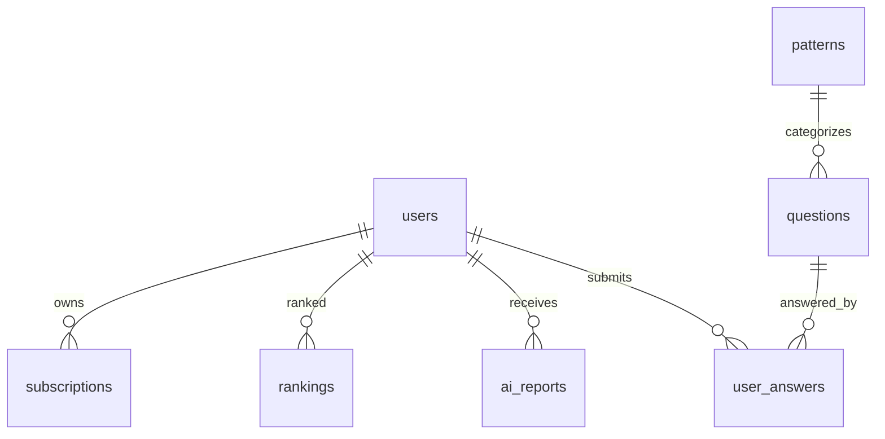

# 차트고시 DB 설계서

## 1. 설계 개요

차트고시 DB는 PostgreSQL을 기준으로 설계한다. MVP에서는 문제, 패턴, 사용자 답안, 랭킹, 구독, AI 리포트의 핵심 흐름을 안정적으로 저장하는 것을 우선한다. 자동 패턴 탐지와 원천 OHLCV 저장은 Phase 3에서 별도 테이블로 확장한다.

### 주요 원칙

- 모든 핵심 테이블은 `id`, `created_at`, `updated_at`을 가진다.
- 사용자 판단 데이터는 `user_answers`에 최대한 풍부하게 저장한다.
- 차트 데이터와 AI 분석 결과처럼 구조가 진화할 데이터는 JSONB를 사용한다.
- MVP 차트 데이터는 `questions.chart_data`와 `questions.actual_next_candles` JSONB에 저장한다.
- 삭제는 기본적으로 soft delete보다 상태값을 우선 사용한다.

## 2. Enum 정의

```sql
CREATE TYPE user_plan AS ENUM ('free', 'premium', 'b2b');
CREATE TYPE subscription_status AS ENUM ('trialing', 'active', 'past_due', 'canceled', 'expired');
CREATE TYPE question_difficulty AS ENUM ('easy', 'medium', 'hard');
CREATE TYPE market_regime AS ENUM ('bull', 'sideways', 'bear', 'volatile');
CREATE TYPE answer_direction AS ENUM ('up', 'sideways', 'down');
CREATE TYPE ranking_period_type AS ENUM ('daily', 'weekly', 'monthly', 'all_time');
CREATE TYPE report_status AS ENUM ('pending', 'completed', 'failed');
```

## 3. 테이블 설계

## 3.1 users

사용자 계정과 기본 프로필을 저장한다.

| 컬럼 | 타입 | 제약 | 설명 |
| --- | --- | --- | --- |
| id | uuid | PK | 사용자 ID |
| email | varchar(255) | UNIQUE, NOT NULL | 로그인 이메일 |
| password_hash | text | nullable | 소셜 로그인 사용 시 null 가능 |
| nickname | varchar(80) | NOT NULL | 표시 이름 |
| avatar_url | text | nullable | 프로필 이미지 |
| plan | user_plan | NOT NULL, default `free` | 현재 플랜 |
| daily_question_limit | integer | NOT NULL, default 10 | 무료 사용자 일일 제한 |
| streak_days | integer | NOT NULL, default 0 | 연속 퀴즈 일수 |
| last_played_at | timestamptz | nullable | 마지막 풀이 시각 |
| created_at | timestamptz | NOT NULL | 생성 시각 |
| updated_at | timestamptz | NOT NULL | 수정 시각 |

**인덱스**

- `idx_users_email` on `(email)`
- `idx_users_plan` on `(plan)`

## 3.2 patterns

차트 패턴 마스터 데이터를 저장한다.

| 컬럼 | 타입 | 제약 | 설명 |
| --- | --- | --- | --- |
| id | uuid | PK | 패턴 ID |
| slug | varchar(80) | UNIQUE, NOT NULL | URL/API 식별자 |
| name | varchar(120) | NOT NULL | 패턴명 |
| description | text | nullable | 패턴 설명 |
| icon_style | jsonb | nullable | UI 색상/아이콘 메타데이터 |
| sort_order | integer | NOT NULL | 노출 순서 |
| is_active | boolean | NOT NULL, default true | 활성 여부 |
| created_at | timestamptz | NOT NULL | 생성 시각 |
| updated_at | timestamptz | NOT NULL | 수정 시각 |

**초기 데이터**

| slug | name |
| --- | --- |
| cup-and-handle | 컵앤핸들 |
| double-bottom | W바닥 |
| box-breakout | 박스권 돌파 |
| new-high-breakout | 신고가 돌파 |
| pullback | 눌림목 |
| triangle | 삼각수렴 |
| flag | 깃발형 |
| inverse-head-shoulders | 역헤드앤숄더 |
| moving-average-breakout | 이동평균선 돌파 |
| volume-spike | 거래량 급증 |

**인덱스**

- `idx_patterns_slug` on `(slug)`
- `idx_patterns_active_sort` on `(is_active, sort_order)`

## 3.3 questions

출제 가능한 차트 문제를 저장한다.

| 컬럼 | 타입 | 제약 | 설명 |
| --- | --- | --- | --- |
| id | uuid | PK | 문제 ID |
| pattern_id | uuid | FK patterns.id, NOT NULL | 패턴 |
| symbol | varchar(40) | NOT NULL | 종목/자산 심볼 |
| market | varchar(40) | NOT NULL | 시장 구분 |
| timeframe | varchar(20) | NOT NULL, default `1d` | 봉 주기 |
| difficulty | question_difficulty | NOT NULL | 난이도 |
| market_regime | market_regime | NOT NULL | 시장 국면 |
| base_date | date | NOT NULL | 기준일 |
| chart_data | jsonb | NOT NULL | 기준일까지의 OHLCV 배열 |
| actual_next_candles | jsonb | NOT NULL | 숨겨진 다음 5봉 |
| correct_answer | answer_direction | NOT NULL | 정답 |
| ai_explanation | text | nullable | 문제 해설 |
| rule_score | numeric(5,2) | nullable | 룰 기반 패턴 점수 |
| public_accuracy | numeric(5,4) | nullable | 전체 정답률 캐시 |
| total_answers | integer | NOT NULL, default 0 | 누적 제출 수 |
| is_active | boolean | NOT NULL, default true | 출제 가능 여부 |
| created_at | timestamptz | NOT NULL | 생성 시각 |
| updated_at | timestamptz | NOT NULL | 수정 시각 |

**JSONB 구조**

`chart_data`

```json
[
  {
    "time": "2024-06-21",
    "open": 100.0,
    "high": 104.0,
    "low": 98.0,
    "close": 102.0,
    "volume": 1200000,
    "ma20": 99.5,
    "ma60": 95.2
  }
]
```

`actual_next_candles`는 동일한 OHLCV 구조로 다음 5개 봉만 저장한다.

**인덱스**

- `idx_questions_pattern_difficulty` on `(pattern_id, difficulty)`
- `idx_questions_active_base_date` on `(is_active, base_date DESC)`
- `idx_questions_market_regime` on `(market_regime)`
- `idx_questions_correct_answer` on `(correct_answer)`

## 3.4 user_answers

사용자의 문제 풀이와 판단 데이터를 저장한다. 차트고시의 핵심 자산 테이블이다.

| 컬럼 | 타입 | 제약 | 설명 |
| --- | --- | --- | --- |
| id | uuid | PK | 답안 ID |
| user_id | uuid | FK users.id, NOT NULL | 사용자 |
| question_id | uuid | FK questions.id, NOT NULL | 문제 |
| selected_answer | answer_direction | NOT NULL | 사용자 선택 |
| correct_answer | answer_direction | NOT NULL | 제출 시점의 정답 스냅샷 |
| is_correct | boolean | NOT NULL | 정답 여부 |
| confidence | integer | nullable | 확신도 0~100 |
| reason_tags | text[] | NOT NULL, default `{}` | 선택 이유 태그 |
| answer_duration_ms | integer | nullable | 선택까지 걸린 시간 |
| is_retry | boolean | NOT NULL, default false | 재도전 여부 |
| viewed_ai_explanation | boolean | NOT NULL, default false | 해설 확인 여부 |
| session_id | uuid | nullable | 게임 세션 ID |
| client_meta | jsonb | nullable | 디바이스, 앱 버전 등 |
| created_at | timestamptz | NOT NULL | 제출 시각 |
| updated_at | timestamptz | NOT NULL | 수정 시각 |

**reason_tags 후보**

- `volume`
- `moving_average`
- `pattern`
- `trend`
- `intuition`

**인덱스**

- `idx_user_answers_user_created` on `(user_id, created_at DESC)`
- `idx_user_answers_user_correct` on `(user_id, is_correct, created_at DESC)`
- `idx_user_answers_question` on `(question_id)`
- `idx_user_answers_session` on `(session_id)`
- `idx_user_answers_retry` on `(user_id, is_retry)`

**제약**

- `confidence`는 0 이상 100 이하.
- 중복 제출 방지는 API에서 idempotency key를 사용하고, 필요 시 `(user_id, question_id, session_id, is_retry)` 유니크 정책을 추가한다.

## 3.5 ai_reports

사용자의 투자 판단 성향 분석 결과를 저장한다.

| 컬럼 | 타입 | 제약 | 설명 |
| --- | --- | --- | --- |
| id | uuid | PK | 리포트 ID |
| user_id | uuid | FK users.id, NOT NULL | 사용자 |
| status | report_status | NOT NULL, default `pending` | 생성 상태 |
| period_start | date | NOT NULL | 분석 시작일 |
| period_end | date | NOT NULL | 분석 종료일 |
| answer_count | integer | NOT NULL | 분석에 사용한 답안 수 |
| overall_score | integer | nullable | 종합 점수 |
| percentile | numeric(5,2) | nullable | 상위 백분위 |
| pattern_accuracy | jsonb | nullable | 패턴별 정답률 |
| trait_scores | jsonb | nullable | 성향 점수 |
| summary | text | nullable | 요약 코멘트 |
| recommendations | jsonb | nullable | 추천 훈련/문제 |
| model_name | varchar(80) | nullable | 사용 AI 모델 |
| error_message | text | nullable | 실패 사유 |
| created_at | timestamptz | NOT NULL | 생성 시각 |
| updated_at | timestamptz | NOT NULL | 수정 시각 |

**JSONB 구조**

`trait_scores`

```json
{
  "aggressiveness": 72,
  "trend_following": 81,
  "reversal_detection": 58,
  "confidence_calibration": 66
}
```

`recommendations`

```json
[
  {
    "pattern_slug": "volume-spike",
    "reason": "거래량 급증 문제 정답률이 낮습니다.",
    "priority": 1
  }
]
```

**인덱스**

- `idx_ai_reports_user_created` on `(user_id, created_at DESC)`
- `idx_ai_reports_user_period` on `(user_id, period_start, period_end)`
- `idx_ai_reports_status` on `(status)`

## 3.6 rankings

기간별 사용자 랭킹을 저장한다.

| 컬럼 | 타입 | 제약 | 설명 |
| --- | --- | --- | --- |
| id | uuid | PK | 랭킹 ID |
| user_id | uuid | FK users.id, NOT NULL | 사용자 |
| period_type | ranking_period_type | NOT NULL | 기간 유형 |
| period_start | date | nullable | 기간 시작일, all_time은 null 가능 |
| score | integer | NOT NULL, default 0 | 점수 |
| accuracy | numeric(5,4) | NOT NULL, default 0 | 정답률 |
| solved_count | integer | NOT NULL, default 0 | 풀이 수 |
| correct_count | integer | NOT NULL, default 0 | 정답 수 |
| rank_position | integer | nullable | 집계된 순위 |
| streak_days | integer | NOT NULL, default 0 | 연속 기록 |
| created_at | timestamptz | NOT NULL | 생성 시각 |
| updated_at | timestamptz | NOT NULL | 수정 시각 |

**인덱스**

- `idx_rankings_period_score` on `(period_type, period_start, score DESC)`
- `idx_rankings_user_period` on `(user_id, period_type, period_start)`
- `idx_rankings_rank_position` on `(period_type, period_start, rank_position)`

**유니크**

- `uq_rankings_user_period` on `(user_id, period_type, period_start)`

## 3.7 subscriptions

구독 상태와 결제 연동 정보를 저장한다.

| 컬럼 | 타입 | 제약 | 설명 |
| --- | --- | --- | --- |
| id | uuid | PK | 구독 ID |
| user_id | uuid | FK users.id, NOT NULL | 사용자 |
| plan | user_plan | NOT NULL | 구독 플랜 |
| status | subscription_status | NOT NULL | 구독 상태 |
| provider | varchar(40) | nullable | 결제 제공자 |
| provider_customer_id | varchar(255) | nullable | 외부 고객 ID |
| provider_subscription_id | varchar(255) | nullable | 외부 구독 ID |
| current_period_start | timestamptz | nullable | 현재 기간 시작 |
| current_period_end | timestamptz | nullable | 현재 기간 종료 |
| cancel_at_period_end | boolean | NOT NULL, default false | 기간 종료 후 취소 여부 |
| created_at | timestamptz | NOT NULL | 생성 시각 |
| updated_at | timestamptz | NOT NULL | 수정 시각 |

**인덱스**

- `idx_subscriptions_user_status` on `(user_id, status)`
- `idx_subscriptions_provider_customer` on `(provider, provider_customer_id)`
- `idx_subscriptions_provider_subscription` on `(provider, provider_subscription_id)`

## 4. 관계 요약

- `users` 1:N `user_answers`
- `users` 1:N `ai_reports`
- `users` 1:N `rankings`
- `users` 1:N `subscriptions`
- `patterns` 1:N `questions`
- `questions` 1:N `user_answers`



## 5. MVP 데이터 흐름

1. 관리자가 `patterns`와 `questions`를 등록한다.
2. 사용자가 문제를 조회하면 `questions`와 `patterns`를 읽는다.
3. 사용자가 답안을 제출하면 `user_answers`를 생성한다.
4. 제출 후 `questions.total_answers`, `questions.public_accuracy`를 갱신하거나 배치로 집계한다.
5. 랭킹 점수는 `user_answers`를 기반으로 `rankings`에 반영한다.
6. AI 리포트는 `user_answers`와 `questions`를 조합해 `ai_reports`에 저장한다.

## 6. Phase 3 확장 후보

자동 패턴 탐지 단계에서는 다음 테이블을 추가한다.

| 테이블 | 목적 |
| --- | --- |
| `market_assets` | 종목/자산 마스터 |
| `ohlcv_candles` | 원천 OHLCV 데이터 |
| `pattern_detections` | 룰 기반 탐지 결과 |
| `question_generation_jobs` | 문제 생성 배치 작업 |

MVP에서는 확장 후보를 구현하지 않고, `questions`의 JSONB 구조가 향후 마이그레이션될 수 있도록 문서화만 한다.

## 7. 데이터 품질과 보안

- 답안 데이터는 AI 분석의 핵심 자산이므로 삭제보다 익명화 정책을 우선 검토한다.
- 이메일, 결제 식별자 등 개인정보는 최소한으로 저장한다.
- AI 리포트에는 민감한 개인정보를 넣지 않는다.
- 차트 데이터는 학습용 데이터이며, 실제 투자 판단 근거로 제공하지 않는다는 고지를 서비스 레벨에서 유지한다.
